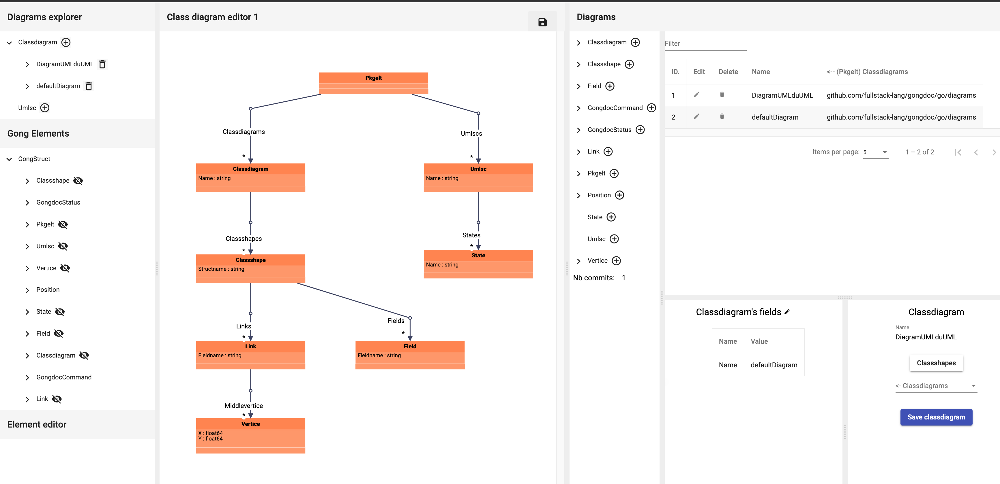

A gong stack for editing UML diagrams of gong code

### compile application
> cd ng; npm i; ng build;

### launch application

at the root of the repository (requires go >= 1.16)
> go run main.go

### expected result

launch browser on http://localhost:8080

